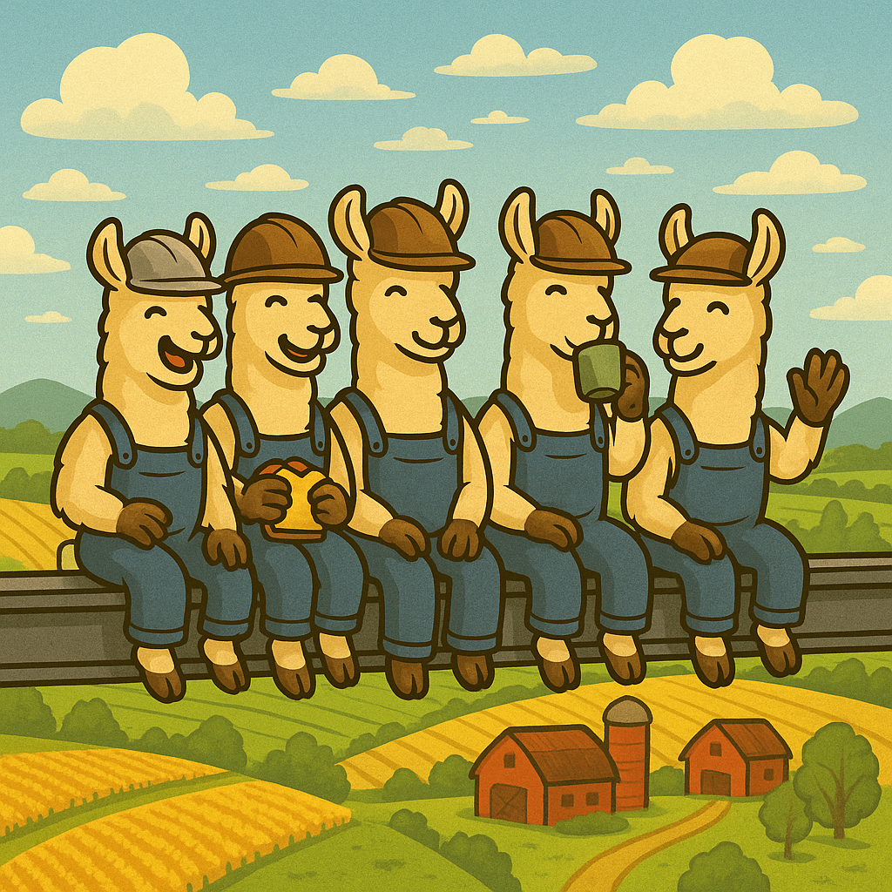

# 🦙 LlamaFarm - Build Powerful AI Locally, Deploy Anywhere

<div align="center">
  
  
  **Empowering developers to build production-ready AI applications with complete local control**
  
  [](https://opensource.org/licenses/MIT)
  [](https://www.python.org/downloads/)
  [](CONTRIBUTING.md)
  [](https://discord.gg/llamafarm)
  
   [Getting Started](#-getting-started) • [Features](#-features) • [Contributing](#-contributing)
</div>

---

## 🚀 What is LlamaFarm?

LlamaFarm is a comprehensive, modular framework for building AI Projects that run locally, collaborate, and deploy anywhere. We provide battle-tested components for RAG systems, vector databases, model management, prompt engineering, and fine-tuning - all designed to work seamlessly together or independently.  

### 🎯 Our Mission

We believe AI development should be:
- **Local First**: Full control over your data and models
- **Production Ready**: Built for scale from day one
- **Developer Friendly**: Configuration over code, with sensible defaults
- **Modular**: Use what you need, ignore what you don't
- **Open**: No vendor lock-in, works with any provider

## 🏗️ Building in the Open

We're building LlamaFarm in public! Join us:
- 🐛 [Report bugs](https://github.com/llama-farm/llamafarm/issues)
- 💡 [Request features](https://github.com/llama-farm/llamafarm/discussions)
- 🤝 [Contribute code](CONTRIBUTING.md)
- 💬 [Join our Discord](https://discord.gg/llamafarm)

---

## ✨ Features

### 🔍 RAG (Retrieval-Augmented Generation)
*Transform any document into AI-accessible knowledge with strategy-based configuration*

- **🎯 Strategy System**: Choose from 9 pre-configured strategies (simple, legal, customer_support, etc.)
- **📄 Universal Document Support**: Parse PDFs, CSVs, Markdown, web pages, and more
- **🧩 Modular Pipeline**: Mix and match parsers, embedders, and vector stores
- **🎯 Smart Retrieval**: 5+ retrieval strategies including hybrid search and re-ranking
- **🔌 Database Agnostic**: Works with ChromaDB, Pinecone, Weaviate, Qdrant, and more
- **📊 Local Extractors**: Built-in extractors for metadata enrichment without LLMs
- **⚡ Production Ready**: Batch processing, error handling, and progress tracking

**Quick Example (Strategy-Based):**
```bash
# Use predefined strategy for quick setup
uv run python rag/cli.py --strategy customer_support ingest support_docs/

# Search with strategy-optimized retrieval
uv run python rag/cli.py --strategy legal search "contract termination clause"

# List available strategies
uv run python rag/cli.py strategies list
```

[Learn more about RAG →](rag/README.md)

### 🤖 Model Management
*Run and manage AI models locally or in the cloud with complete fine-tuning support*

- **🌍 Multi-Provider Support**: OpenAI, Anthropic, Google, Cohere, Together, Groq, Ollama, HuggingFace
- **🎓 Fine-Tuning System**: Production-ready fine-tuning with LoRA, QLoRA, and full training
- **💰 Cost Optimization**: Automatic provider fallbacks and smart routing
- **📊 Usage Tracking**: Monitor tokens, costs, and performance
- **🔄 Load Balancing**: Distribute requests across multiple providers
- **🎛️ Fine Control**: Rate limiting, retry logic, and timeout management
- **🏠 Local Models**: Full support for Ollama and HuggingFace models

**Quick Example:**
```yaml
# config/models.yaml
providers:
  primary:
    provider: "openai"
    model: "gpt-4o-mini"
    fallback_to: "local_llama"
  
  local_llama:
    provider: "ollama"
    model: "llama3.2"
    temperature: 0.7
```

**Fine-Tuning Example:**
```bash
# Use strategy-based fine-tuning
uv run python models/cli.py finetune start --strategy mac_m1_lora --dataset data.jsonl

# Custom fine-tuning
uv run python models/cli.py finetune start \
  --dataset my_data.jsonl \
  --base-model llama3.1-8b \
  --method lora
```

[Learn more about Models →](models/README.md)

### 📝 Prompt Engineering
*Enterprise-grade prompt management system*

- **📚 20+ Templates**: Pre-built templates for common use cases
- **🧠 Smart Selection**: Context-aware template selection
- **🔄 A/B Testing**: Built-in experimentation framework
- **🎯 6 Template Categories**: Basic, Chat, Few-shot, Advanced, Domain-specific, Agentic
- **🤝 Multi-Agent Support**: Coordinate multiple AI agents
- **📊 Evaluation Tools**: 5 evaluation templates for quality assessment

**Quick Example:**
```bash
# List all templates
uv run python prompts/cli.py template list

# Execute with smart selection
uv run python prompts/cli.py execute "Analyze this medical report" --domain medical

# Evaluate responses
uv run python prompts/cli.py evaluate "AI response text" --template llm_judge
```

[Learn more about Prompts →](prompts/README.md)

---

## 🚀 Getting Started

### Prerequisites
- Python 3.8+
- [uv](https://github.com/astral-sh/uv) (recommended) or pip
- Optional: Ollama for local models
- Optional: Docker for containerized deployment

### Quick Install

```bash
# Clone the repository
git clone https://github.com/llama-farm/llamafarm.git
cd llamafarm

# Install uv (if not already installed)
curl -LsSf https://astral.sh/uv/install.sh | sh

# Set up RAG system
cd rag
uv sync
uv run python cli.py strategies list

# Set up Models system  
cd ../models
uv sync
uv run python cli.py list

# Set up Prompts system
cd ../prompts
uv sync
uv run python -m prompts.cli template list
```

### 🎮 Try the Interactive Demos

#### RAG System Demos
```bash
cd rag
# Run all 5 demos sequentially
uv run python demos/master_demo.py

# Or run individual demos:
uv run python demos/demo1_research_papers.py    # Academic paper analysis
uv run python demos/demo2_customer_support.py   # Support ticket processing
uv run python demos/demo3_code_documentation.py # Code documentation analysis
uv run python demos/demo4_news_analysis.py      # News article processing
uv run python demos/demo5_business_reports.py   # Business report analysis
```

#### Models System Demos
```bash
cd models
# Run all demos
uv run python demos/run_all_demos.py

# Or run individual demos:
uv run python demos/demo1_cloud_with_fallback.py  # Cloud with local fallback
uv run python demos/demo2_multi_model_cloud.py    # Multiple cloud models
uv run python demos/demo3_quick_training.py       # Quick fine-tuning demo
uv run python demos/demo4_complex_training.py     # Advanced training pipeline
```

#### Prompts System Demos
```bash
cd prompts
# Run all demos
uv run python demos/run_all_demos.py

# Or run individual demos:
uv run python demos/demo1_simple_qa.py          # Basic Q&A templates
uv run python demos/demo2_customer_support.py   # Support response generation
uv run python demos/demo3_code_assistant.py     # Code generation templates
uv run python demos/demo4_rag_research.py       # RAG integration demo
uv run python demos/demo5_advanced_reasoning.py # Chain-of-thought reasoning
```

---

## 📚 Documentation

### Component Guides
- 📖 [RAG System Guide](rag/README.md) - Document processing and retrieval
- 🤖 [Models Guide](models/README.md) - Model management, providers, and fine-tuning
- 📝 [Prompts Guide](prompts/README.md) - Prompt engineering and templates

### Developer Guides
- 🏗️ [RAG Architecture](rag/STRUCTURE.md) - RAG system internals
- 🔧 [Models Architecture](models/STRUCTURE.md) - Models system internals
- 📋 [Prompts Architecture](prompts/STRUCTURE.md) - Prompts system internals

### Strategy Documentation
- 🎯 [RAG Strategies](rag/STRATEGY_SYSTEM_SUMMARY.md) - Complete RAG strategy guide
- 🎓 [Fine-Tuning Strategies](models/strategies/README.md) - Training strategy guide

### API Reference
- 🔌 [RAG API](rag/api.py) - RESTful API for RAG operations
- 🤖 [Models CLI](models/cli.py) - Complete CLI documentation
- 📝 [Prompts CLI](prompts/prompts/core/cli/strategy_cli.py) - Prompts CLI reference

---

## 🛠️ Architecture

LlamaFarm follows a modular, strategy-driven architecture:

```
llamafarm/
├── rag/                          # Document processing and retrieval
│   ├── components/               # Component-based architecture
│   │   ├── embedders/           # Text embedding models
│   │   ├── extractors/          # Content extractors
│   │   ├── parsers/             # Document parsers
│   │   ├── retrievers/          # Retrieval strategies
│   │   └── stores/              # Vector databases
│   ├── strategies/              # Pre-configured strategies
│   ├── demos/                   # Interactive demonstrations
│   └── schema.yaml              # Component schemas
│
├── models/                      # Model management & fine-tuning
│   ├── components/              # Component-based architecture
│   │   ├── cloud_apis/          # Cloud provider integrations
│   │   ├── fine_tuners/         # Fine-tuning implementations
│   │   ├── model_apps/          # Local model runners
│   │   └── model_repositories/  # Model registry integrations
│   ├── strategies/              # Training strategies
│   ├── demos/                   # Interactive demonstrations
│   └── cli.py                   # Unified CLI interface
│
├── prompts/                     # Prompt engineering
│   ├── templates/               # Template library
│   ├── strategies/              # Template strategies
│   ├── demos/                   # Interactive demonstrations
│   └── core/                    # Core functionality
│
└── config/                      # Shared configuration
    └── *.yaml                   # YAML-first configuration
```

### Key Design Principles
- **Strategy System**: Pre-configured setups for specific use cases
- **Component Architecture**: Modular, extensible components
- **Factory Pattern**: Dynamic component creation and registration
- **YAML Configuration**: Human-readable, well-documented configs
- **Local-First**: Prioritize local execution with cloud options

---

## 🌟 Why LlamaFarm?

### For Developers
- **🏠 Local First**: Run everything on your machine, no API keys required
- **🔧 Hackable**: Clean, modular code that's easy to understand and extend
- **📦 Batteries Included**: Pre-built components for common use cases
- **🎯 Production Ready**: Built with scale, monitoring, and reliability in mind

### For Teams
- **💰 Cost Control**: Optimize spending with multi-provider support
- **🔒 Data Privacy**: Keep sensitive data on-premise
- **🚀 Fast Iteration**: Hot-reload configs, no redeploys needed
- **📊 Full Visibility**: Built-in monitoring and analytics

### For Enterprises
- **🏢 Multi-Tenant**: Isolated environments for different teams
- **🔐 Security First**: SOC2-ready with audit logging
- **📈 Scalable**: From laptop to cluster without code changes
- **🤝 Vendor Neutral**: No lock-in, works with any provider

---

## 🤝 Contributing

<div align="center">
  
  
  **Join our herd of contributors building the future of local AI!**
</div>

We love contributions! Whether you're fixing bugs, adding features, or improving documentation, we'd love to have you aboard.

### How to Contribute
1. 🍴 Fork the repository
2. 🌿 Create a feature branch (`git checkout -b feature/amazing-feature`)
3. 💻 Make your changes
4. ✅ Run tests (`uv run pytest`)
5. 📝 Commit your changes (`git commit -m 'Add amazing feature'`)
6. 🚀 Push to the branch (`git push origin feature/amazing-feature`)
7. 🎉 Open a Pull Request

See our [Contributing Guide](CONTRIBUTING.md) for more details.

### Good First Issues
- 🏷️ [good-first-issue](https://github.com/llama-farm/llamafarm/labels/good-first-issue)
- 📚 [documentation](https://github.com/llama-farm/llamafarm/labels/documentation)
- 🧪 [testing](https://github.com/llama-farm/llamafarm/labels/testing)

---

## 🙏 Open Source Credits

LlamaFarm is built on the shoulders of giants. Special thanks to:

### Core Dependencies
- 🦜 [LangChain](https://github.com/hwchase17/langchain) - LLM orchestration
- 🤗 [Transformers](https://github.com/huggingface/transformers) - Model library
- 🎯 [ChromaDB](https://github.com/chroma-core/chroma) - Vector database
- 📊 [Pandas](https://github.com/pandas-dev/pandas) - Data manipulation
- 🔥 [PyTorch](https://github.com/pytorch/pytorch) - Deep learning

### Development Tools
- 🚀 [uv](https://github.com/astral-sh/uv) - Fast Python package management
- 🧪 [pytest](https://github.com/pytest-dev/pytest) - Testing framework
- 📝 [Pydantic](https://github.com/pydantic/pydantic) - Data validation
- 🎨 [Rich](https://github.com/Textualize/rich) - Beautiful terminal output

See [CREDITS.md](docs/CREDITS.md) for a complete list.

---

## 📄 License

LlamaFarm is MIT licensed. See [LICENSE](LICENSE) for details.

---

## 💬 Community

Join the LlamaFarm community:

- 💬 [Discord Server](https://discord.gg/llamafarm) - Chat with the community
- 🐛 [GitHub Issues](https://github.com/llama-farm/llamafarm/issues) - Report bugs
- 💡 [GitHub Discussions](https://github.com/llama-farm/llamafarm/discussions) - Share ideas

---

<div align="center">
  <p>
    <b>Ready to farm some AI? 🦙🚜</b>
  </p>
  <p>
    <a href="https://github.com/llama-farm/llamafarm">⭐ Star us on GitHub</a> • 
    <a href="https://discord.gg/llamafarm">💬 Join Discord</a> • 
    <a href="https://twitter.com/llamafarm">🐦 Follow on Twitter</a>
  </p>
</div>